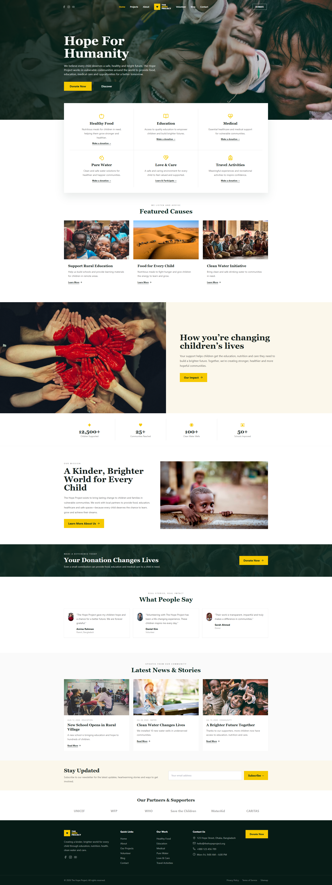

# 🌱 The Hope Project

> **Creating hope, empowering communities, and building brighter futures.**
>

**The Hope Project** is a modern, responsive charity and humanitarian website built to connect people with meaningful causes, volunteer opportunities, community projects, and donation initiatives.

The project is designed with a clean, warm, and trustworthy visual style using a **forest green, cream, white, and gold** color palette.

---

## ✨ Features

### 🏠 Home

* Engaging hero section
* Featured causes
* Services and initiatives
* Impact statistics
* Testimonials
* Newsletter subscription
* Responsive design

### ❤️ Causes & Projects

* Community-focused projects
* Education initiatives
* Food support
* Clean water programs
* Healthcare initiatives
* Responsive project cards

### 🤝 Volunteer

* Volunteer opportunities
* Volunteer application form
* Volunteer profiles
* "Meet Our Volunteers" section
* Application data stored in browser `localStorage`

### 💝 Donation

* Donation interface
* Donation amount selection
* Donation information
* Frontend donation demo
* Donation data stored using `localStorage`

> **Note:** This project does not process real payments or connect to a payment gateway.

### 📝 Blog

* Blog listing page
* Blog categories
* Search functionality
* Category filtering
* Load More functionality
* Dynamic blog detail pages
* SEO-friendly dynamic routes

### 📬 Contact

* Contact form
* Contact information
* Google Maps integration
* Dhaka, Bangladesh location
* Contact submissions stored in `localStorage`

### 📧 Newsletter

* Newsletter subscription form
* Browser-based subscription storage
* Toast notification feedback

---

## 🛠️ Tech Stack

| Technology            | Purpose                      |
| --------------------- | ---------------------------- |
| **Next.js 15**        | React framework              |
| **React 19**          | UI development               |
| **JavaScript**        | Application logic            |
| **Tailwind CSS**      | Styling & responsive design  |
| **Lucide React**      | Icons                        |
| **React Hot Toast**   | Notifications                |
| **LocalStorage**      | Client-side data persistence |
| **Google Maps Embed** | Location display             |
| **Unsplash**          | Project imagery              |

---

## 📁 Project Structure

```text
the-hope-project/
│
├── app/
│   ├── about/
│   │   └── page.js
│   │
│   ├── blog/
│   │   ├── [slug]/
│   │   │   └── page.js
│   │   └── page.js
│   │
│   ├── contact/
│   │   └── page.js
│   │
│   ├── donate/
│   │   └── page.js
│   │
│   ├── projects/
│   │   └── page.js
│   │
│   ├── volunteer/
│   │   └── page.js
│   │
│   ├── globals.css
│   ├── layout.js
│   └── page.js
│
├── components/
│   ├── BlogCard.jsx
│   ├── CauseCard.jsx
│   ├── Footer.jsx
│   ├── Logo.jsx
│   ├── Navbar.jsx
│   ├── Newsletter.jsx
│   ├── PageHero.jsx
│   ├── ProjectCard.jsx
│   ├── SectionTitle.jsx
│   ├── ToastProvider.jsx
│   └── VolunteerCard.jsx
│
├── lib/
│   ├── data.js
│   └── storage.js
│
├── public/
│   └── reference-design.png
│
├── next.config.mjs
├── postcss.config.mjs
├── tailwind.config.js
├── jsconfig.json
└── package.json
```

---

## 📄 Available Pages

| Route          | Page         |
| -------------- | ------------ |
| `/`            | Home         |
| `/projects`    | Projects     |
| `/about`       | About        |
| `/volunteer`   | Volunteer    |
| `/blog`        | Blog         |
| `/blog/[slug]` | Blog Details |
| `/contact`     | Contact      |
| `/donate`      | Donate       |

---

## 🚀 Getting Started

### 1. Clone the repository

```bash
git clone YOUR_GITHUB_REPOSITORY_URL
```

### 2. Open the project

```bash
cd the-hope-project
```

### 3. Install dependencies

```bash
npm install
```

### 4. Start the development server

```bash
npm run dev
```

### 5. Open in your browser

```text
http://localhost:3000
```

---

## 🏗️ Production Build

Create a production build:

```bash
npm run build
```

Then start the production server:

```bash
npm start
```

---

## 📱 Responsive Design

The Hope Project is designed to work across:

* 💻 Desktop
* 💻 Laptop
* 📱 Mobile
* 📲 Tablet

The navigation also includes a responsive hamburger menu for smaller screens.

---

## 💾 Data Storage

This project uses the browser's **LocalStorage API** for demo data persistence.

Currently stored data includes:

* Newsletter subscriptions
* Volunteer applications
* Contact form submissions
* Donation demo data

This makes the project fully functional on the frontend without requiring a backend database.

---

## 🎨 Design

The visual direction of the website focuses on:

* 🌲 Forest green
* 🤍 Cream
* ⚪ White
* ✨ Gold accents
* Rounded cards
* Clean typography
* Responsive layouts
* Humanitarian imagery
* Clear calls-to-action

The design is inspired by modern charity and nonprofit websites while maintaining a custom project structure and component system.

---

## 🔔 User Feedback

**React Hot Toast** is used to provide immediate feedback when users:

* Submit forms
* Subscribe to the newsletter
* Submit volunteer applications
* Complete donation demo actions

---

## 🗺️ Google Maps

The contact page includes a Google Maps embed showing:

**Dhaka, Bangladesh**

This provides visitors with an easy way to locate the organization.

---

## 🖼️ Images

The project currently uses **Unsplash** image URLs for demonstration purposes.

For production use, replace these images with properly licensed or organization-owned images.

---

## ⚠️ Important Notes

This is a **frontend-focused charity website project**.

The following features are currently demonstrations:

* Donation processing
* Contact submissions
* Volunteer applications
* Newsletter subscriptions

No real payment gateway or production backend/database is connected.

For a production version, these can be connected to services such as:

* Payment Gateway
* PostgreSQL / MongoDB
* Authentication
* Backend API
* Email service
* Admin dashboard
* Cloud storage

---

## 🔮 Future Improvements

Possible future upgrades include:

* [ ] Real payment gateway integration
* [ ] Backend API
* [ ] PostgreSQL/MongoDB database
* [ ] Admin dashboard
* [ ] User authentication
* [ ] Volunteer management system
* [ ] Donation history
* [ ] Email notifications
* [ ] CMS-powered blog
* [ ] Donation analytics
* [ ] User accounts
* [ ] Cloud image storage

---

## 👨‍💻 Developer

Developed as a modern **Next.js + React charity website project** with a focus on responsive UI, reusable components, and frontend functionality.

---

## 📜 License

This project is created for educational, portfolio, and demonstration purposes.

---

## ❤️ The Mission

> **Small actions can create big changes.**

The Hope Project aims to bring people, communities, volunteers, and donors together to create meaningful and lasting positive change.

**Together, we can build a better future. 🌍❤️**
